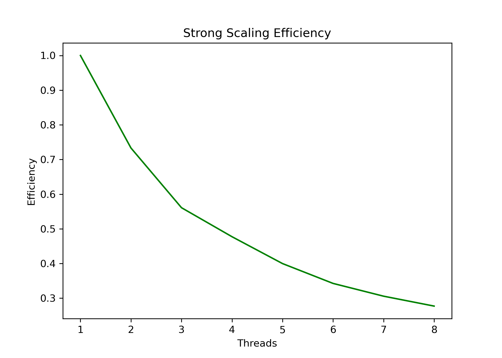

# Numerical Methods for PDEs: Parallel Computation in Python

This repository contains an implementation of numerical methods for solving Partial Differential Equations (PDEs) with a focus on parallel computing. The project includes code for solving Poisson’s equation, performance benchmarking, and visualization of results.

## Project Overview

The key components of this project include:

- **Poisson Equation Solver**: Implements numerical solutions to the Poisson equation using finite difference methods.
- **Parallel Computing**: Uses multi-threading to optimize computations and analyze speedup efficiency.
- **Performance Benchmarking**: Compares execution times across different thread counts.
- **Visualization**: Generates plots of computational errors and efficiency trends.

## Directory Structure

```
Numerical-PDEs-Parallel/
├── README.md
├── report/
│   ├── results.pdf
│   ├── timings_plot.png
│   ├── error_analysis.png
│   ├── efficiency_vs_threads.png
│   ├── time_vs_threads.png
├── code/
│   ├── check_matvec.py        # Matrix-vector multiplication validation
│   ├── hw4_skeleton.py        # Main PDE solver implementation
│   ├── timingThreadsPlot.py   # Benchmarking and visualization
│   ├── poisson.py             # Poisson equation solver
│   ├── data_outputs/          # Results and logs
```

## How to Run the Code

### Step 1: Install Dependencies

Ensure you have Python 3 and required libraries installed:

```
pip install numpy matplotlib
```

### Step 2: Run the Solver

Navigate to the `code` directory and execute:

```
cd code
ipython3 hw4_skeleton.py
```

This will compute the solution and generate performance metrics.

### Step 3: View Results

Plots and benchmarking data will be saved in the `report/` directory.

## Results

- **Speedup Analysis**: Evaluates computational efficiency across different thread counts.
- **Error Visualization**: Compares accuracy of the numerical method with theoretical expectations.
- **Efficiency Trends**: Observes diminishing returns in performance scaling.

You can view the detailed results in the report below:

 **[Click here to view the full report](report/results.pdf)**  

### Key Insights:
- **Speedup Analysis**: Evaluates computational efficiency across different thread counts.
- **Error Visualization**: Compares accuracy of the numerical method with theoretical expectations.
- **Efficiency Trends**: Observes diminishing returns in performance scaling.

#### Sample Plot:



## Key Takeaways

- Multi-threading significantly reduces computation time for large grid sizes.
- Performance gains diminish as the number of threads increases beyond a threshold.
- Numerical errors remain within acceptable bounds for practical use cases.

## Contact Information

**Steven Zúñiga**  
stzuniga@unm.edu

